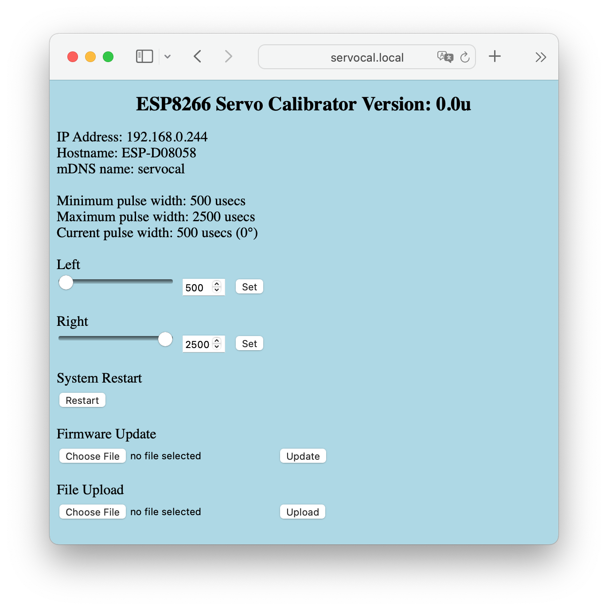

# ESP8266 Servo Calibration Tool

## Introduction
This software utility implements the ability to control the position of a servo attached to an ESP8266 device.  The commands to control the device are sent to the ESP8266 via a WiFi HTTP connection.

The utility has been tested on a NodeMCU 1.0 driving a generic SG90 servo.



## Build Environment
The utility has been built and testing combinations of the following:
- Arduino 1.8.16
- ESP8266 Arduino Boards 3.0.2
- Arduinojson 6.18.5
- Adafruit PWM Servo Driver Library 2.4.0 (If using PWM)
- Visual Studio Code 1.62.3 with Arduino Extension 0.4.8

## Configuration

### Arduino Board Configuration
Assuming a NodeMCU 1.0 is the hardware platform choosen, the critical configuation items for the board would look thusly:
``` 
Board: NodeMCU 1.0 (ESP12-E Module)
Flash Size: 4MB (FS: 1MB,OTA: ~1019kb)
```
The requirements for the SPIFFS file system are modest, so the 1 MB allocation is sufficient.

### Servo Attachment
The utility will need to be generated for each type of servo connect: direct, or via a I2C PCA96855 controller.  The default is for a directly connected servo.  The PCA9685 mode must be explcity specified by changing the following lines in the source:
```
/* define either SERVO or PWM based on connectivy choice */
#define SERVO
//#define PWM
```

With the default direct connected servo, the pin used for this purpose is D7.  This can be changed in the source at:
```
#define SERVO_PIN       	D7		// control pin for servo
```

If using the PCA9685 the I2C address for the controller is set to the default, 0x40.  This can be overriden by altering the following:
```
#define PWM_ADDR        	0x40 	// address of PWM
```
Lastly confirm the values for SCL and SDA provided by the platform defines correspond to the pins selected for the I2C bus.  The setup code will print the values associated with each of the defines.

### Wifi
As a WiFi connection on the ESP8266 must be established with suitable credential, the utility needs to be able provide these when or if required.  There are a variety of means to put the credentials in place, ranging from making changes to the utility source, creating a configuration file in the SPIFFS file system, or having established the credentials with other software loaded to the ESP8266.

The credentials can be embedded in the utility by means of initializing the following variables shown in the code snippet below:

```
/* the following can be set from the config.json file */
String wifiSSID = "yourSSID";		// ssid
String wifiPSK = "yourPSK";			// psk
```

Alternatively a configuration file can be generated and placed in the flash-resident SPIFFS on the ESP8266.  Here's the sample "example-config.json" provided in the data/ subdirectory:
```
{
	"ssid":		"YourSSID",
	"psk": 		"YourPSK",
	"node":		"servocal",
	"min":		"500",
	"max":		"2500"
}
```
Once customized the file should be uploaded to the SPIFFS as "config.json".  Two alternatives exist for uploading the file:

- Via the ESP8266 Sketch Data Upload plugin.
- The "Upload File" capability provided by this utility, obviously useful only operational.

The utility must be restarted in order for the updated configuration to be used.

## Operation

### Connecting to the web server
The IP address and NodeID are output to the serial device upon startup.  The web server may be accessed from a browser by entering:
```
http://<nodeid>.local
```
or
```
http://<IP.address>
```
as the web address.  Once connected, a page similar to that shown above will appear.

Althought the IP address assigned may be variable, the <nodeid>.local address will not vary so may be preferred.

### Servo Calibration
By default the utility will move the servo to the left-most position upon starting.  To adjust either the right or left position, either:
> use the horizontal scroll bar to change the value

> use the numeric entry field to change the value

As the value is changed both the position of the scroll bar and numeric value are updated.  To case the servo to be positioned to the selected value click the "Set" button.
Values are constrained by the minimum and maximum values established for the servo.  By default these are 500 and 2500 usecs, however, can be changed in the configuration file.

To move from one side to the other, simply click the appropriate "Set" button.

### Reset
The system may be reset, i.e., rebooted, by means of this button.

### Upload File
This provides the ability to update a file to the SPIFFs, such as the configuration file.  When selected, a file chooser diaglogue appears for picking the file to be uploaded.  Once a file has been selected, the "Upload" button will cause the file to the transferred.

### Update Firmware
The utility firmware may be updated by means of this.  As with the Upload File process, a file should be selected, and then the "Update" button pressed.  Suitable firmware files can be produced in the Arduino environment by means of the Sketch/Export Binary.  This will place the binary with a .bin suffix in the directory containing the sketch.